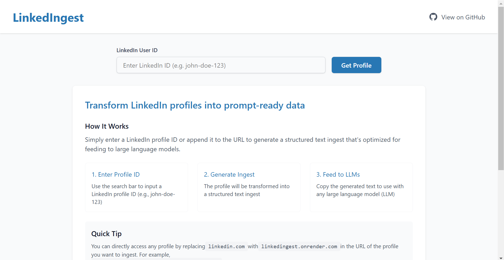

> **NOTE:** This branch implements some rate-limiting in the backend, so fetching profiles can be very slow. You can avoid the rate-limiting by using the main branch.

<div align="center">
  <a href="https://github.com/endernoke/linkedingest">
    
  </a>

  <h1 align="center">LinkedIngest</h1>

  <p align="center">
    Transform LinkedIn profiles into prompt-ready data for Large Language Models
    <br />
    <a href="https://linkedingest.onrender.com">View Demo</a>
    ·
    <a href="https://github.com/endernoke/linkedingest/issues/new?template=bug_report.md">Report Bug</a>
    ·
    <a href="https://github.com/endernoke/linkedingest/issues/new?template=feature_request.md">Request Feature</a>
  </p>
</div>

## About The Project

LinkedIngest is a web application that converts LinkedIn profiles into structured text format optimized for feeding to Large Language Models (LLMs). It extracts comprehensive profile information including:
- Basic info (name, headline, location)
- Experience history
- Education background
- Projects
- Skills & Languages
- Certifications
- Publications
- Volunteer work
- Recent posts and activities

The extracted data is formatted in a clean, consistent markdown-like text structure that's ideal for LLM ingestion.

### Built With

* Frontend: React + Vite + TailwindCSS
* Backend: FastAPI + Python

## Getting Started

To get a local copy up and running, follow these steps:

### Prerequisites

* Python
* Pip
* npm
* PostgreSQL database (for this branch only)
* A valid LinkedIn account (don't use your own if possible)

### Installation

1. Clone the repo
   ```sh
   git clone https://github.com/endernoke/linkedingest.git
   cd linkedingest
   ```

2. Create a `.env` file in the project's root directory and add the following environment variables:
   ```env
   LINKEDIN_AGENT_USERNAME=your_linkedin_email
   LINKEDIN_AGENT_PASSWORD=your_linkedin_password
   DB_URL=your_postgres_connection_string
   ```

3. Install dependencies and build
  - For Mac/Linux:
   ```sh
   ./scripts/build.sh
   ```
  - For Windows:
   ```sh
   sh ./scripts/build.sh
   ```

4. Start the application
  - For Mac/Linux:
   ```sh
   ./scripts/start.sh
   ```
  - For Windows:
   ```sh
   sh ./scripts/start.sh
   ```

5. The app will be running on `http:// 0.0.0.0:10000`. Navigate to this link in your browser.

## Usage

There are two ways to access someone's profile ingest:
- **Direct URL Access**: Replace `linkedin.com` with `linkedingest.onrender.com` in any LinkedIn profile URL:
   ```
   https://linkedin.com/in/john-doe-123 → https://linkedingest.onrender.com/in/john-doe-123
   ```

- **Search by ID**: Enter a LinkedIn profile ID in the search bar:
   ```
   john-doe-123
   ```

Click on any of the example profiles provided on the homepage to see how the app works.

The generated text output can be:
- Copied entirely or by sections
- Downloaded as a text file
- Used directly with any LLM

### Example Use Cases

Here are some example use cases for LinkedIngest:

- **Writing Engaging Invitations**: Quickly analyze LinkedIn profiles to craft personalized and engaging connection requests or messages.
- **Networking**: Prepare for networking events by summarizing the profiles of attendees, helping you to make meaningful connections.
- **Content Creation**: Generate content ideas or write articles based on the professional experiences and skills of LinkedIn users.
- **Sales Outreach**: Personalize sales pitches by understanding the background and interests of potential clients or partners.

## Contributing

Any contributions you make are **greatly appreciated**.

1. Fork the Project
2. Create your Feature Branch
3. Commit your Changes
4. Push to the Branch
5. Open a Pull Request

You can also contribute by:
- [Reporting Bugs](https://github.com/endernoke/linkedingest/issues/new?template=bug_report.md)
- [Requesting Features](https://github.com/endernoke/linkedingest/issues/new?template=feature_request.md)

## License

Distributed under the [MIT License](LICENSE).

## Contact

[James Zheng](https://linkedin.com/in/james-zheng-zi)

Project Link: [https://github.com/endernoke/linkedingest](https://github.com/endernoke/linkedingest)

## Acknowledgements

* [linkedin-api](https://github.com/tomquirk/linkedin-api) - Python library for accessing LinkedIn data
* [Best-README-Template](https://github.com/othneildrew/Best-README-Template) - README template used for this project